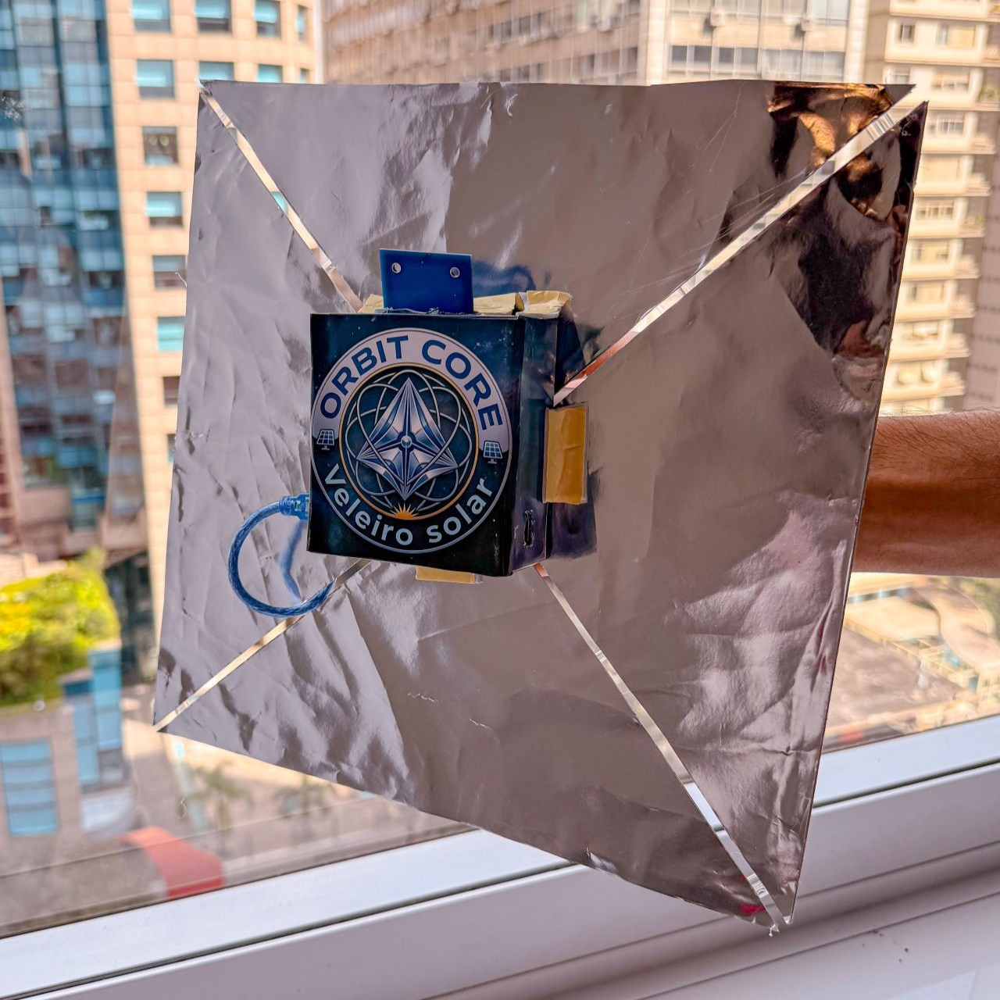
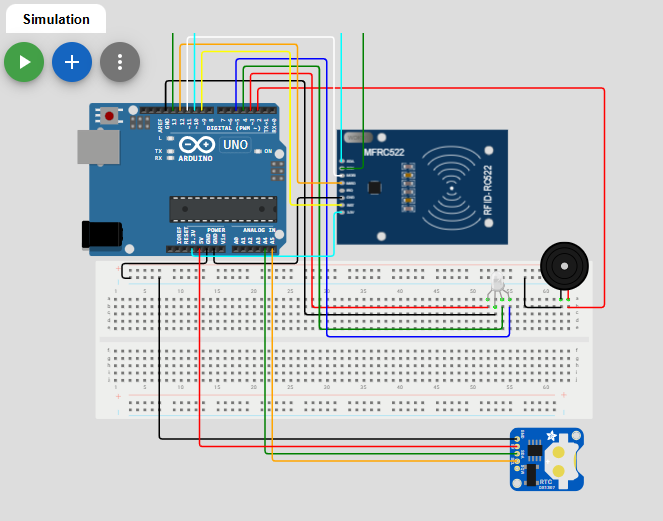

<div align="center">

#  OrbitCore

### Sonda Veleiro Solar de Exploração de Exoplanetas

*"Transforme a luz em possibilidades."*

🏆 **Projeto CAMPEÃO — 1º lugar na Global Solution 2026 da FIAP** 🏆


**[🌐 Acessar o Site](https://iantassiotto.github.io/Projeto_OrbitCore/)**    ·    **[🎥 Assistir ao Vídeo](https://www.youtube.com/watch?v=8CI5FU4M9v0)**

</div>

---

## Sobre a Missão

E se a luz das estrelas pudesse nos guiar a novos lares?

A **OrbitCore** é uma prova de conceito de uma sonda autônoma movida por **vela solar**. Sem a necessidade de combustíveis tradicionais, ela utiliza a pressão de radiação estelar (fótons) para navegar pelo cosmos até o sistema **TRAPPIST-1**, localizado a 40 anos-luz da Terra.

Lá, sua missão é identificar os 7 planetas rochosos (simulados via **tecnologia RFID**) e cruzar dados cruciais — como temperatura, gravidade, atmosfera e o Índice de Similaridade com a Terra (ESI) — para descobrir qual deles possui o maior potencial de habitabilidade.

Desenvolvido para a **Global Solution 2026 da FIAP** sob o tema *"Indústria Espacial: O Código que Move o Universo"*, este projeto unifica ciência real de dados exoplanetários (NASA/James Webb) com engenharia de hardware acessível, conquistando o **1º lugar** na competição.

---

## O Protótipo Físico

<div align="center">
  
  
  <br/>

</div>

O protótipo tangibiliza o conceito de exploração espacial. O corpo central abriga o "cérebro" da sonda, contendo:
* **Microcontrolador Arduino Uno**
* **Leitor MFRC522 (RFID)** para "escanear" a assinatura única de cada planeta.
* **Módulo RTC DS3231** para carimbar o momento exato de cada descoberta sideral.
* **Módulo EEPROM** para armazenamento não-volátil dos dados da missão (Dossiê de Scan).
* **LEDs RGB e Buzzer** para feedback visual e sonoro de navegação e alertas atmosféricos.

---

## Gêmeo Digital: Simulação no Wokwi

  
  <br/>

Quer testar a sonda agora mesmo sem o hardware físico? Criamos uma simulação completa do circuito OrbitCore na plataforma Wokwi. 

**[Clique aqui para abrir no Wokwi em Tela Cheia](https://wokwi.com/projects/465213890222709761)** 

---

## Arquitetura do Sistema

O OrbitCore opera sob uma arquitetura de três camadas altamente integradas:

1. **Hardware (IoT / Sonda):** O Arduino processa as leituras das tags RFID (planetas), gerencia as memórias e o relógio em tempo real, disparando alertas de aproximação.
2. **Central Prisma (Python / Data Science):** Recebe os dados de telemetria da sonda. Utiliza modelagem matemática (3ª Lei de Kepler, cálculo do ESI) para validar órbitas, zonas habitáveis e gerar relatórios visuais com Matplotlib.
3. **Plataforma Web (Front-End):** O painel público, inspirado na NASA, apresentando o catálogo de descobertas e visualizações imersivas dos mundos detectados.

---

## Firmware da Sonda (Código-Fonte)

O núcleo operacional da sonda foi desenvolvido em C++ para Arduino. O código gerencia a identificação planetária, o registro histórico em EEPROM e a interface homem-máquina (IHM).

<details>
<summary><b> Clique aqui para expandir o Código C++ do OrbitCore</b></summary>

```cpp
/*
  OrbitCore - Sonda TRAPPIST-1
  Versão RFID + EEPROM + LED RGB + RTC 
  Placa: Arduino Uno
*/ 

#include <SPI.h>
#include <MFRC522.h>
#include <EEPROM.h>
#include <Wire.h>
#include <RTClib.h>

#define RST_PIN     9
#define SS_PIN      10
#define BUZZER_PIN  2
#define LED_R       3
#define LED_G       4
#define LED_B       5

#define EEPROM_CONTADOR    0
#define EEPROM_ORDEM       10
#define EEPROM_ORDEM_MAX   30
#define EEPROM_DATALOG     40
#define EEPROM_MAGIC_VAL   43
#define EEPROM_ESI         70
#define EEPROM_MAGIC_ADDR  100

const char* nomePlaneta[4] = {
  "TRAPPIST-1b",
  "TRAPPIST-1c",
  "TRAPPIST-1d",
  "TRAPPIST-1e"
};

const byte uidPlaneta[4][4] = {
  {0x04, 0x11, 0x22, 0x33},
  {0x11, 0x22, 0x33, 0x44},
  {0xAA, 0xBB, 0xCC, 0xDD},
  {0x55, 0x66, 0x77, 0x88}
};

// ESI por planeta (1b, 1c, 1d, 1e)
const byte ESIplaneta[4] = {30, 57, 71, 85};

MFRC522 leitor(SS_PIN, RST_PIN);
RTC_DS3231 rtc;

void setup() {
  Serial.begin(9600);
  SPI.begin();
  leitor.PCD_Init();
  Wire.begin();

  pinMode(LED_R, OUTPUT);
  pinMode(LED_G, OUTPUT);
  pinMode(LED_B, OUTPUT);
  pinMode(BUZZER_PIN, OUTPUT);
  setRGB(0, 0, 0);

  Serial.println(F("===================================="));
  Serial.println(F(" ORBITCORE - SISTEMA TRAPPIST-1"));
  Serial.println(F(" Sonda de Exploração Espacial"));
  Serial.println(F("===================================="));

  if (!rtc.begin()) {
    Serial.println(F("[ERRO] RTC não encontrado!"));
    while (1);
  }
  if (rtc.lostPower()) {
    Serial.println(F("[RTC] Sem energia - ajustando hora..."));
    rtc.adjust(DateTime(F(__DATE__), F(__TIME__)));
  }

  if (EEPROM.read(EEPROM_MAGIC_ADDR) != EEPROM_MAGIC_VAL) {
    for (int i = 0; i < 4; i++) EEPROM.write(EEPROM_CONTADOR + i, 0);
    for (int s = 0; s < EEPROM_ORDEM_MAX; s++) EEPROM.write(EEPROM_ORDEM + s, 0);
    for (int d = 0; d < 24; d++) EEPROM.write(EEPROM_DATALOG + d, 0);
    for (int v = 0; v < 4; v++) EEPROM.write(EEPROM_ESI + v, 0);
    EEPROM.write(EEPROM_MAGIC_ADDR, EEPROM_MAGIC_VAL);
    Serial.println(F("[EEPROM] Inicializada."));
  }

  imprimirHoraAtual();
  imprimirRegistroMissao();
  Serial.println(F("Aguardando aproximação da sonda..."));
  Serial.println();
}

void loop() {
  if (!leitor.PICC_IsNewCardPresent()) return;
  if (!leitor.PICC_ReadCardSerial()) return;

  int planeta = identificarPlaneta(leitor.uid.uidByte, leitor.uid.size);

  if (planeta >= 0) {
    escanearPlaneta(planeta);
  } else {
    Serial.println(F("Fazendo varredura do planeta..."));
    for (int p = 0; p < 3; p++) {
      setRGB(255, 255, 0);
      tone(BUZZER_PIN, 500);
      delay(500);
      setRGB(0, 0, 0);
      noTone(BUZZER_PIN);
      delay(500);
    }
    setRGB(255, 0, 0);
    Serial.println(F("Reconhecimento falhou."));
    for (int i = 0; i < 3; i++) {
      tone(BUZZER_PIN, 400);
      delay(300);
      noTone(BUZZER_PIN);
      delay(300);
    }
    setRGB(0, 0, 0);
    Serial.println();
  }

  leitor.PICC_HaltA();
  delay(500);
}

void setRGB(byte r, byte g, byte b) {
  analogWrite(LED_R, r);
  analogWrite(LED_G, g);
  analogWrite(LED_B, b);
}

int identificarPlaneta(byte* uid, byte tamanho) {
  if (tamanho < 4) return -1;
  for (int i = 0; i < 4; i++) {
    bool combina = true;
    for (int b = 0; b < 4; b++) {
      if (uid[b] != uidPlaneta[i][b]) { combina = false; break; }
    }
    if (combina) return i;
  }
  return -1;
}

void escanearPlaneta(int i) {
  Serial.println();
  Serial.println(F("Fazendo varredura do planeta..."));

  for (int p = 0; p < 3; p++) {
    setRGB(255, 255, 0);
    tone(BUZZER_PIN, 500);
    delay(500);
    setRGB(0, 0, 0);
    noTone(BUZZER_PIN);
    delay(500);
  }
  setRGB(0, 255, 0);
  tone(BUZZER_PIN, 1000);
  delay(1000);
  setRGB(0, 0, 0);
  noTone(BUZZER_PIN);

  DateTime agora = rtc.now();
  registrarDescoberta(i, agora);
  imprimirDossie(i);

  Serial.println(F("Enviando dados para Central Prisma..."));
  delay(2000);
  Serial.println(F("Dados enviados!"));
  Serial.println();
}

void registrarDescoberta(int i, DateTime dt) {
  byte cont = EEPROM.read(EEPROM_CONTADOR + i);
  if (cont < 255) EEPROM.write(EEPROM_CONTADOR + i, cont + 1);

  if (cont == 0) {
    for (int s = 0; s < EEPROM_ORDEM_MAX; s++) {
      if (EEPROM.read(EEPROM_ORDEM + s) == 0) {
        EEPROM.write(EEPROM_ORDEM + s, i + 1);
        break;
      }
    }
  }

  int base = EEPROM_DATALOG + (i * 6);
  EEPROM.write(base + 0, (byte)(dt.year() - 2000));
  EEPROM.write(base + 1, dt.month());
  EEPROM.write(base + 2, dt.day());
  EEPROM.write(base + 3, dt.hour());
  EEPROM.write(base + 4, dt.minute());
  EEPROM.write(base + 5, dt.second());

  EEPROM.write(EEPROM_ESI + i, ESIplaneta[i]);
}

void imprimirDateTime(int base) {
  byte aa = EEPROM.read(base + 0);
  byte mm = EEPROM.read(base + 1);
  byte dd = EEPROM.read(base + 2);
  byte hh = EEPROM.read(base + 3);
  byte mi = EEPROM.read(base + 4);
  byte ss = EEPROM.read(base + 5);

  if (aa == 0 && mm == 0 && dd == 0) {
    Serial.print(F("--/--/---- --:--:--"));
    return;
  }

  if (dd < 10) Serial.print(F("0")); Serial.print(dd);
  Serial.print(F("/"));
  if (mm < 10) Serial.print(F("0")); Serial.print(mm);
  Serial.print(F("/20"));
  if (aa < 10) Serial.print(F("0")); Serial.print(aa);
  Serial.print(F("  "));
  if (hh < 10) Serial.print(F("0")); Serial.print(hh);
  Serial.print(F(":"));
  if (mi < 10) Serial.print(F("0")); Serial.print(mi);
  Serial.print(F(":"));
  if (ss < 10) Serial.print(F("0")); Serial.print(ss);
}

void imprimirHoraAtual() {
  DateTime agora = rtc.now();
  Serial.print(F(" Hora RTC: "));
  if (agora.day() < 10) Serial.print(F("0"));
  Serial.print(agora.day());
  Serial.print(F("/"));
  if (agora.month() < 10) Serial.print(F("0"));
  Serial.print(agora.month());
  Serial.print(F("/"));
  Serial.print(agora.year());
  Serial.print(F("  "));
  if (agora.hour() < 10) Serial.print(F("0"));
  Serial.print(agora.hour());
  Serial.print(F(":"));
  if (agora.minute() < 10) Serial.print(F("0"));
  Serial.print(agora.minute());
  Serial.print(F(":"));
  if (agora.second() < 10) Serial.print(F("0"));
  Serial.println(agora.second());
}

void imprimirRegistroMissao() {
  Serial.println();
  Serial.println(F("--- Registro de Missão (EEPROM + RTC) ---"));
  bool algoDescoberto = false;
  for (int i = 0; i < 4; i++) {
    byte cont = EEPROM.read(EEPROM_CONTADOR + i);
    if (cont > 0) {
      Serial.print(nomePlaneta[i]);
      Serial.print(F(" - "));
      Serial.print(cont);
      Serial.print(F("x | Scan: "));
      imprimirDateTime(EEPROM_DATALOG + (i * 6));
      Serial.print(F(" | ESI: "));
      Serial.print(EEPROM.read(EEPROM_ESI + i) / 100.0, 2);
      Serial.println();
      algoDescoberto = true;
    }
  }
  if (!algoDescoberto) Serial.println(F("Nenhum planeta descoberto."));
  Serial.println(F("-----------------------------------------"));
}

void imprimirDossie(int i) {
  DateTime agora = rtc.now();
  byte cont = EEPROM.read(EEPROM_CONTADOR + i);

  Serial.println();
  Serial.println(F("===================================="));
  Serial.print(F("  ")); Serial.println(nomePlaneta[i]);
  Serial.println(F("===================================="));
  Serial.print(F(" Escaneado: ")); Serial.print(cont); Serial.println(F(" vez(es)"));
  Serial.print(F(" Este scan:  "));
  if (agora.day() < 10) Serial.print(F("0")); Serial.print(agora.day());
  Serial.print(F("/"));
  if (agora.month() < 10) Serial.print(F("0")); Serial.print(agora.month());
  Serial.print(F("/"));
  Serial.print(agora.year());
  Serial.print(F("  "));
  if (agora.hour() < 10) Serial.print(F("0")); Serial.print(agora.hour());
  Serial.print(F(":"));
  if (agora.minute() < 10) Serial.print(F("0")); Serial.print(agora.minute());
  Serial.print(F(":"));
  if (agora.second() < 10) Serial.print(F("0")); Serial.println(agora.second());
  Serial.println(F("------------------------------------"));

  switch (i) {
    case 0:
      Serial.println(F(" Tipo: Super-Terra rochosa"));
      Serial.println(F(" Ano (órbita): 1.51 dias terrestres"));
      Serial.println(F(" Rotação: Síncrona (Tidally Locked)"));
      Serial.println(F(" Distância da estrela: 0.0115 UA"));
      Serial.println(F(" Gravidade: 1.08 g"));
      Serial.println(F(" Temperatura média: 124 °C"));
      Serial.println(F(" Atmosfera: Inexistente (nenhum gás detectado)"));
      Serial.println(F(" ESI: BAIXO (0.30)"));
      break;
    case 1:
      Serial.println(F(" Tipo: Super-Terra rochosa"));
      Serial.println(F(" Ano (órbita): 2.42 dias terrestres"));
      Serial.println(F(" Rotacao: Síncrona (Tidally Locked)"));
      Serial.println(F(" Distância da estrela: 0.0158 UA"));
      Serial.println(F(" Gravidade: 1.09 g"));
      Serial.println(F(" Temperatura média: 62 °C"));
      Serial.println(F(" Atmosfera: Praticamente inexistente (CO₂ residual)"));
      Serial.println(F(" ESI: MODERADO (0.57)"));
      break;
    case 2:
      Serial.println(F(" Tipo: Sub-Terra rochosa"));
      Serial.println(F(" Ano (órbita): 4.05 dias terrestres"));
      Serial.println(F(" Rotação: Síncrona (Tidally Locked)"));
      Serial.println(F(" Distância da estrela: 0.0223 UA"));
      Serial.println(F(" Gravidade: 0.65 g"));
      Serial.println(F(" Temperatura média: 13 °C"));
      Serial.println(F(" Atmosfera: Fina (CO₂, H₂O (vapor), N₂)"));
      Serial.println(F(" ESI: ALTO (0.71)"));
      break;
    case 3:
      Serial.println(F(" Tipo: Rochoso, tamanho da Terra"));
      Serial.println(F(" Ano (órbita): 6.10 dias terrestres"));
      Serial.println(F(" Rotação: Síncrona (Tidally Locked)"));
      Serial.println(F(" Distância da estrela: 0.0293 UA"));
      Serial.println(F(" Gravidade: 0.93 g"));
      Serial.println(F(" Temperatura: -23 °C"));
      Serial.println(F(" Atmosfera: Semelhante à Terra (N₂, CO₂, H₂O e traços de CH₄ e O₂)"));
      Serial.println(F(" ESI: MUITO ALTO (0.85) - Zona Habitável!"));
      break;
  }
  Serial.println(F("===================================="));
}